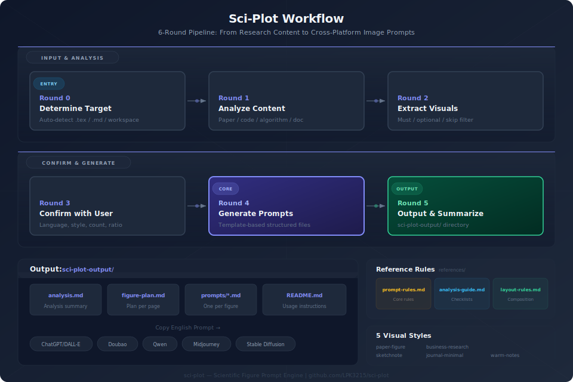

<div align="center">

# Sci-Plot — 科研绘图 —— 从论文到插图的一站式引擎

[](LICENSE)
[](CHANGELOG_CN.md)
[](SKILL.md)

科研绘图，从论文到插图的一站式引擎。不直接生图，只产出跨平台提示词。

[English Documentation](README.md)

</div>

## 工作流架构



## 典型使用场景

**论文写好了，该配图了。** 你的 LaTeX 论文（`.tex` 文件）已经完成，方法、公式、实验都写了，但缺少一张高质量的方法架构图或机制流程图。把项目目录或 .tex 文件交给 sci-plot，它读完全文后给出图解方案，你确认参数，它输出每张图的提示词。复制提示词到 ChatGPT/DALL-E / 豆包 / Qwen / Midjourney 等工具，几秒钟出图。

**有现成文章的时候效果最好。** 内容越完整、结构越清晰，提取就越精准，生成的提示词也越贴合你的论文学术语境。如果只给一句模糊的想法，sci-plot 也能生成提示词，但会偏泛化、缺少论文特有的学术约束。

也适用于：项目 README 配图、技术博客插图、答辩 PPT 配图、算法讲解图。

## 安装

```bash
git clone https://github.com/LPK3215/sci-plot.git
```

克隆后，打开 sci-plot 目录（或把整个目录作为工作区/子项目打开），AI 就能读到 SKILL.md 中的规则。

## 使用方式

### 基本用法

git clone 后打开 sci-plot 目录，直接发送给 AI 这段提示词：

```
按照 /sci-plot/SKILL.md 技能的要求输出科研绘图提示词。
目标：[可选，不填则自动分析当前项目]
```

**目标**支持以下任意一种写法：

- 留空 → 自动分析当前项目，优先找 `.tex` 文件
- 本地路径 → `/path/to/your/paper/`
- arxiv 链接 → `https://arxiv.org/abs/2401.12345`
- 粘贴内容 → 直接粘贴论文摘要、方法描述或算法步骤
- arxiv ID → `1706.03762`

### 交互流程

1. AI 分析你的内容，给出图解方案建议
2. 你确认：语言（中文/English/双语）、风格、张数、比例、用途
3. AI 生成提示词文件到 `sci-plot-output/prompts/` 目录
4. 你复制提示词到生图工具中出图

### 可用风格

| 风格 | 效果 | 适合 |
|------|------|------|
| **paper-figure**（默认） | 论文框架图风，白底、矢量模块、克制配色 | 论文配图、README、技术展示 |
| **sketchnote** | 温暖科研笔记风，米白底、手绘线条 | 知识分享、学习笔记 |
| **journal-minimal** | Nature/IEEE 风，极简学术 | 论文投稿、答辩 |
| **warm-notes** | 明亮手记风，亲和教学感 | 科普、课程 |
| **business-research** | 商业简报风，结构化数据驱动 | 行业分析、汇报 |

### 提示词复制到哪些工具

| 工具 | 操作 |
|------|------|
| **ChatGPT（推荐）** | 粘贴到 DALL-E |
| 豆包 | 文生图 → 直接粘贴提示词 |
| 通义万相 | 文生图 → 粘贴提示词（英文效果更好） |
| Midjourney | `/imagine` 后粘贴提示词 |
| Stable Diffusion | txt2img 粘贴 |
| 其他生图工具 | 同样适用 |

### 产出文件结构

```
sci-plot-output/
├── analysis.md          # 内容分析摘要
├── figure-plan.md       # 图解方案（每页讲什么）
├── prompts/
│   ├── 01-overview.md   # 第 1 页提示词
│   ├── 02-mechanism.md  # 第 2 页提示词
│   └── ...
└── README.md            # 本说明
```

## 项目结构

```
sci-plot/
├── SKILL.md                              # AI 指令：6 轮强制工作流
├── README.md                             # 用户说明文档（英文）
├── README_CN.md                          # 用户说明文档（中文）
├── LICENSE                               # MIT 许可证
├── CHANGELOG.md                          # 版本历史（英文）
├── CHANGELOG_CN.md                       # 版本历史（中文）
├── CONTRIBUTING.md                       # 贡献指南（英文）
├── CONTRIBUTING_CN.md                    # 贡献指南（中文）
├── .gitignore                            # 版本控制排除
├── .gitattributes                        # 行尾规范化
├── project_overview.html                 # 项目全景观览页入口
├── project_overview/
│   ├── styles.css                        # 深色主题样式
│   └── main.js                           # 交互逻辑
├── docs/
│   ├── architecture.svg                  # 工作流架构图
│   └── scripts/
│       └── generate_architecture.py      # 架构图生成脚本
└── references/
    ├── prompt-rules.md                   # 提示词生成核心规则
    ├── analysis-guide.md                 # 内容分析指南
    ├── layout-rules.md                   # 页面构图与角色定义
    └── styles/
        ├── paper-figure.md               # 论文框架图风
        ├── sketchnote.md                 # 温暖科研笔记风
        ├── journal-minimal.md            # Nature/IEEE 极简风
        ├── warm-notes.md                 # 明亮手记风
        └── business-research.md          # 商业简报风
```

## 常见问题

**Q: sci-plot 能直接生成图片吗？**
A: 不能。sci-plot 只产出提示词，你需要把提示词复制到 ChatGPT/DALL-E、豆包、Qwen、Midjourney 等生图工具中出图。这样做的好处是提示词跨平台通用，不绑定任何特定工具。

**Q: 没有完整的论文或项目能用吗？**
A: 可以，但效果会打折。sci-plot 有现成文章时效果最好——内容越完整、结构越清晰，提取就越精准。如果只给一句模糊的想法，生成的提示词会偏泛化。

**Q: 支持哪些输入格式？**
A: 支持 LaTeX 论文（`.tex`，优先级最高）、Markdown 文档、PDF、Python 源码、arxiv 链接或 ID，以及直接粘贴的文本内容。

**Q: 提示词文件里哪个部分是核心？**
A: 每个提示词文件的 `▶ English Prompt（核心，直接复制）` 部分是核心产出，直接复制到生图工具即可。中文说明、构图描述、内容元素是给人看的解释。

**Q: 如何添加新的视觉风格？**
A: 在 `references/styles/` 下创建新 `.md` 文件，参照现有风格文件的格式，然后在 `SKILL.md` 和 `README.md` 的风格表中注册。详见 [CONTRIBUTING_CN.md](CONTRIBUTING_CN.md)。

**Q: 最多能生成几张图的提示词？**
A: 最少 1 张，最多 10 张。具体张数取决于内容复杂度：简单内容 1-3 张，中等 4-6 张，复杂 6-10 张。

## 作者

- **LPK3215** — [GitHub](https://github.com/LPK3215)

## 许可证

MIT — 详见 [LICENSE](LICENSE)
